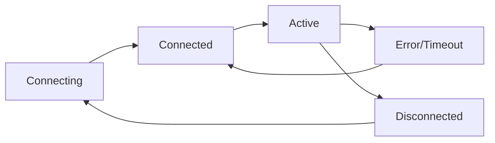

MCPJam Inspector supports all MCP transport protocols, allowing you to test your server regardless of how it's implemented. Each transport has its own characteristics and use cases.

## STDIO Transport

STDIO (Standard Input/Output) transport uses process pipes for communication. This is the most common transport for local MCP server development.

### How It Works

STDIO transport launches your MCP server as a child process and communicates through stdin/stdout:

```
Inspector ←→ stdin/stdout ←→ Your MCP Server Process
```

### Configuration

Connect via the Inspector UI:

1. Go to "MCP Servers" tab
2. Click "Add Server"  
3. Select "STDIO"
4. Enter your server command and arguments


### Command Examples

```bash
# Python FastMCP server
uv run fastmcp run /path/to/server.py

# Node.js server
node /path/to/server.js

# Python with virtual environment
./venv/bin/python server.py --config config.json
```

### CLI Launch (Direct Connection)

Launch Inspector with automatic STDIO connection:

```bash
# Python server
npx @mcpjam/inspector@latest uv run fastmcp run /Users/user/server.py

# Node.js server  
npx @mcpjam/inspector@latest node /Users/user/server.js

# With arguments
npx @mcpjam/inspector@latest python server.py --debug --port 8080
```

<Note>
  **File Paths**: Always use absolute paths when specifying server commands to avoid path resolution issues.
</Note>

### Advantages
- **Simple Setup**: No network configuration required
- **Local Development**: Perfect for development and testing
- **Process Control**: Inspector manages the server lifecycle
- **Debug Output**: See server logs directly in Inspector

### Limitations
- **Local Only**: Cannot connect to remote servers
- **Process Overhead**: Each connection spawns a new process
- **Platform Dependent**: Command syntax varies by OS

## Server-Sent Events (SSE)

SSE transport uses HTTP Server-Sent Events for real-time communication from server to client, with regular HTTP requests for client to server communication.

### How It Works

SSE transport establishes two channels:
- **Client → Server**: Regular HTTP POST requests
- **Server → Client**: Server-Sent Events stream

```
Inspector ←─ SSE Stream ─── Your MCP Server (HTTP)
Inspector ──→ HTTP POST ──→ Your MCP Server (HTTP)
```

### Configuration

1. Start your MCP server with SSE support
2. In Inspector, go to "MCP Servers" tab
3. Click "Add Server"
4. Select "SSE" 
5. Enter your server URL


### Server Implementation Example

```python
from fastapi import FastAPI
from fastapi.responses import StreamingResponse
import asyncio
import json

app = FastAPI()

@app.post("/messages")
async def handle_request(request: dict):
    # Process MCP request
    response = process_mcp_message(request)
    return response

@app.get("/sse")
async def sse_endpoint():
    async def event_stream():
        while True:
            # Send server-initiated messages
            yield f"data: {json.dumps(server_message)}\n\n"
            await asyncio.sleep(1)
    
    return StreamingResponse(event_stream(), media_type="text/plain")
```

### Advantages
- **Real-time**: Immediate server-to-client communication
- **Web Standard**: Uses standard HTTP/SSE protocols
- **Scalable**: Can handle multiple concurrent connections
- **Remote Access**: Works over networks and internet

### Limitations
- **Complexity**: More complex server implementation
- **Firewall Issues**: May be blocked by corporate firewalls
- **Browser Limits**: Connection limits in web browsers

## Streamable HTTP Transport

HTTP transport uses standard HTTP requests with streaming support for large responses.

### How It Works

Bidirectional communication using HTTP requests with optional response streaming:

```
Inspector ←→ HTTP Requests/Responses ←→ Your MCP Server (HTTP)
```

### Configuration

1. Deploy your MCP server as an HTTP service
2. In Inspector, go to "MCP Servers" tab  
3. Click "Add Server"
4. Select "HTTP"
5. Enter your server endpoint URL

### Server Implementation Example

```python
from flask import Flask, request, Response
import json

app = Flask(__name__)

@app.route('/mcp', methods=['POST'])
def handle_mcp():
    mcp_request = request.get_json()
    
    # Process the MCP message
    response = process_mcp_message(mcp_request)
    
    # Return streaming response for large data
    if response.get('large_data'):
        return Response(
            stream_response(response),
            mimetype='application/json'
        )
    
    return response

def stream_response(data):
    # Stream large responses in chunks
    for chunk in split_response(data):
        yield json.dumps(chunk) + '\n'
```

### Advantages
- **Standard Protocol**: Uses familiar HTTP REST patterns
- **Load Balancing**: Easy to load balance and scale
- **Caching**: Can leverage HTTP caching mechanisms
- **Monitoring**: Easy to monitor with standard HTTP tools

### Limitations  
- **Latency**: Higher latency than direct connections
- **Overhead**: HTTP overhead for each message
- **Stateless**: Requires careful state management

## Choosing the Right Transport

| Use Case | Recommended Transport | Why |
|----------|----------------------|-----|
| Local Development | STDIO | Simple, direct, with debug output |
| Remote Testing | HTTP | Standard, reliable, easy to deploy |
| Real-time Features | SSE | Immediate server-to-client messaging |
| Production Deployment | HTTP or SSE | Scalable and robust |
| CI/CD Testing | STDIO | Deterministic and isolated |

## Connection Management

### Health Checks

Inspector automatically monitors connection health:

- **Ping/Pong**: Regular heartbeat messages
- **Timeout Detection**: Identifies unresponsive servers
- **Automatic Reconnection**: Attempts to reconnect on failure
- **Error Reporting**: Detailed connection error messages

### Connection Lifecycle



### Debugging Connection Issues

Common connection problems and solutions:

<Tabs>
  <Tab title="STDIO Issues">
    ```bash
    # Check if command exists
    which python
    which node
    
    # Test command manually
    python /path/to/server.py
    
    # Check permissions
    ls -la /path/to/server.py
    chmod +x /path/to/server.py
    ```
  </Tab>
  
  <Tab title="HTTP/SSE Issues">
    ```bash
    # Test endpoint manually
    curl -X POST http://localhost:8080/mcp \
      -H "Content-Type: application/json" \
      -d '{"method": "ping"}'
    
    # Check server logs
    tail -f server.log
    
    # Verify port access
    netstat -an | grep :8080
    ```
  </Tab>
</Tabs>

## Advanced Configuration

### Environment Variables

Configure transport behavior via environment variables:

```bash
# Connection timeouts
export MCP_CONNECT_TIMEOUT=30000
export MCP_REQUEST_TIMEOUT=60000

# Retry settings  
export MCP_MAX_RETRIES=3
export MCP_RETRY_DELAY=1000

# Buffer sizes
export MCP_BUFFER_SIZE=8192
```

### Custom Headers (HTTP/SSE)

Add custom headers for authentication or routing:

```json
{
  "transport": "http",
  "url": "https://api.example.com/mcp",
  "headers": {
    "Authorization": "Bearer your-token",
    "X-API-Version": "v1",
    "User-Agent": "MCPJam-Inspector/1.0"
  }
}
```

## Performance Considerations

### STDIO Performance
- Low latency for local connections
- Process spawning overhead
- Memory usage per connection

### HTTP/SSE Performance  
- Network latency considerations
- HTTP overhead (headers, parsing)
- Connection pooling benefits
- Caching opportunities

### Monitoring Transport Performance

Inspector provides transport-specific metrics:

- **Message Throughput**: Messages per second
- **Latency Distribution**: P50, P95, P99 latency
- **Error Rates**: Connection and message errors
- **Resource Usage**: Memory and CPU per transport

## Next Steps

Once you've chosen and configured your transport:

1. **Test Your Server**: Use the [Compliance Testing](/inspector/mcp-compliance) to validate your implementation
2. **Debug Issues**: Leverage [Debugging Tools](/inspector/debugging) to troubleshoot problems  
3. **Scale Testing**: Test multiple concurrent connections